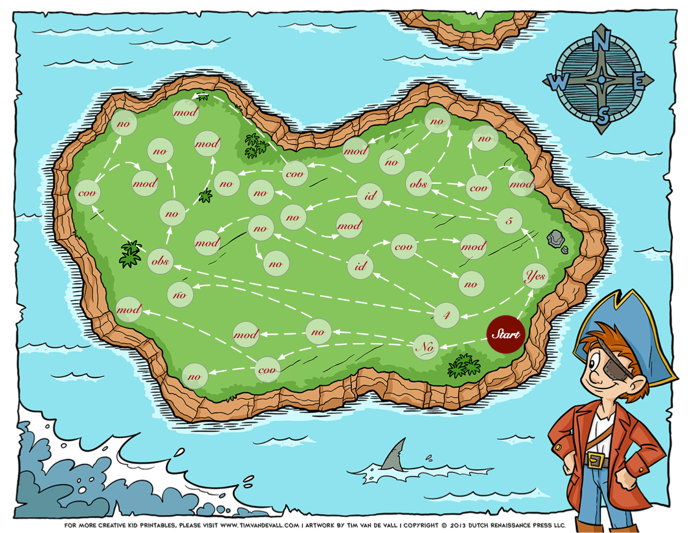
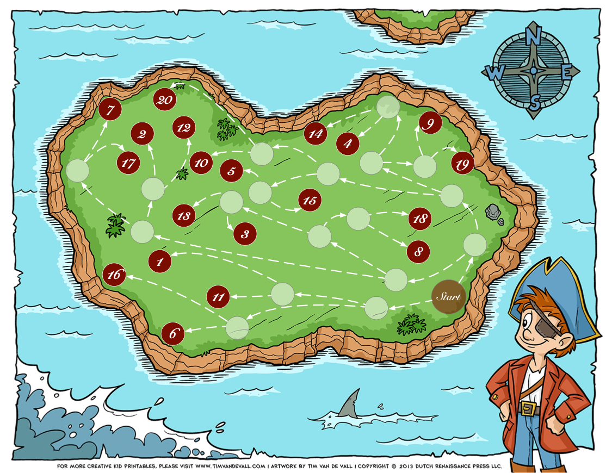
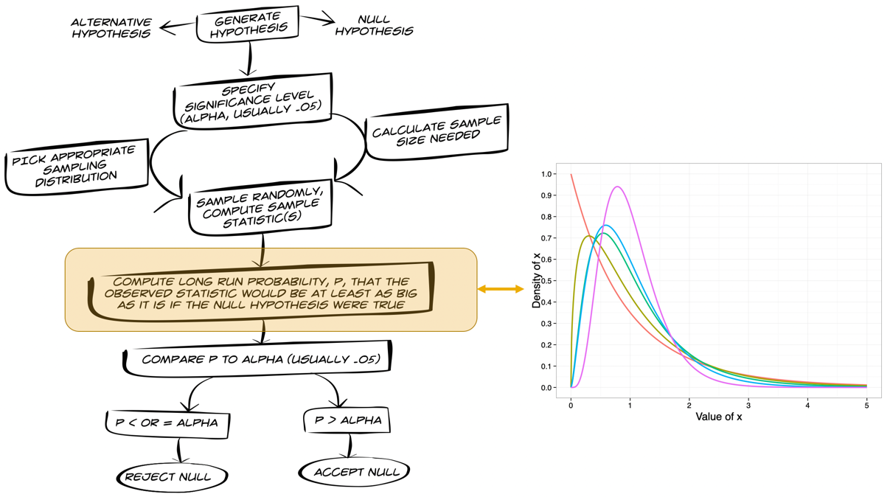
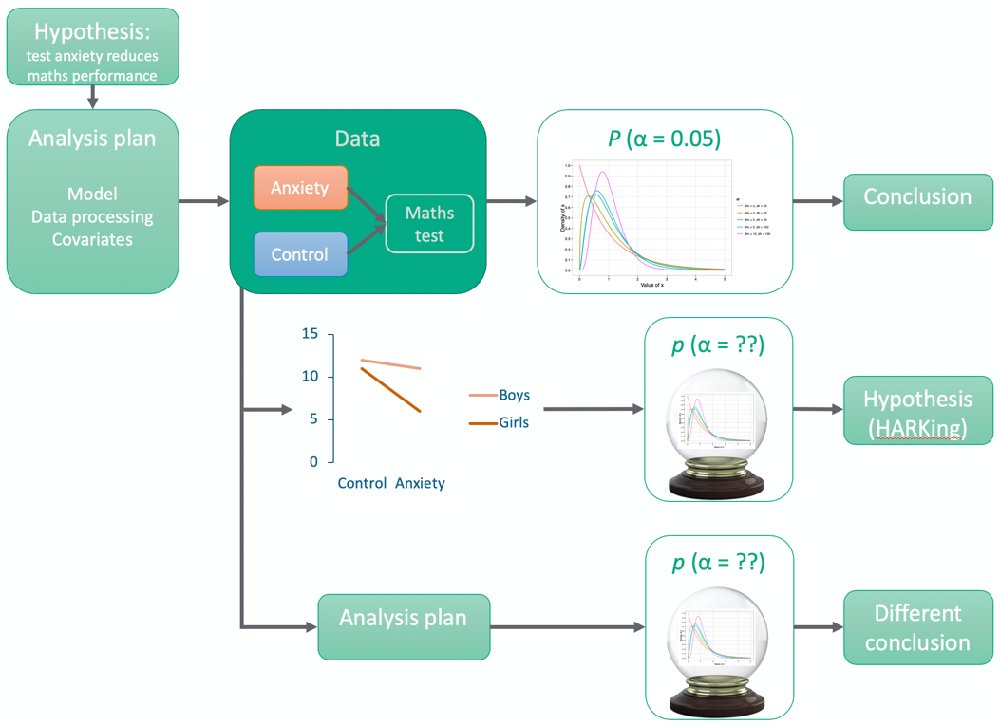

```{r setup, include=FALSE}
options(htmltools.dir.version = FALSE)
knitr::opts_chunk$set(echo = FALSE, warning = FALSE, message = FALSE)

library(here)
library(kableExtra)
library(tidyverse)

mod_sum <- here("/models/peer_mod_sum.csv") %>%
  read_csv()

# here("/models/peer_models.rda") %>% attach()

# summary(agg_mod)

cbBlack<-"#000000"
cbGrey<-"#999999"
cbOrange<-"#E69F00"
cbBlue<-"#56B4E9"
cbGreen<-"#009E73"
cbYellow<-"#F0E442"
cbBlueDark<-"#0072B2"
cbOrangeDark<-"#D55E00"
cbPink<-"#CC79A7"
cbRed<-"#DF4738"

```


## Violence breeds violence

You hypothesise that violent acts by a child (protagonist) on a peer will be predicted by previous physical aggression from that peer towards the protagonist. Children across multiple schools were selected randomly to be the focus of the study. For each child (protagonist), self-report measures were taken of various peer's previous physical and relational aggression towards them. Over various break times, the protagonist's interactions with these peers were observed and each interaction was coded as to whether, at any point, the protagonist acted violently towards the peer. Across the study there were 863 different protagonists, 746 different peers and a total of 40,286 coded interactions<sup>1</sup>. Protagonists could interact with a given peer more than once, but were never a peer to a different protagonist.

- Outcome (**violence**): peer interactions (*i*) contained a violent act (1) or not (0)
- **peer_id** (*j*): peer identifier
- **child_id** (*k*): protagonist identifier
- **phys_agg**: rating of previous physical aggression from peer to protagonist
- **relate_agg**: rating of previous relational aggression from peer to protagonist
- **sex**: biological sex of the protagonist

.footnote[
[1] At this point it should be obvious that the data are not from a real peer relations study. I used a subsample of the data on red cards in soccer matches used by [Silberzahn et al. (2018). Advances in Methods and Practices in Psychological Science, 1, 337–356](https://doi.org/10.1177/2515245917747646) but changed the variable names to ones relevant to peer relations!
]
---
## The model

- Observations (potentially) nested within protagonist and peer, I'm ignoring school as a contextual variable.

$$\begin{align}
\text{ln}\Bigg(\frac{p(\text{violence})_{ijk}}{1-p(\text{violence})_{ijk}}\Bigg) &= \pi_{0jk} + \pi_{1}\text{Phy agg}_{ijk} + \epsilon_{ijk} \\
\pi_{0jk} &= \gamma_{000} + \nu_{0k} + \mu_{0jk} + \zeta_{0ijk} \\
\end{align}$$


```{r, echo = TRUE, eval = FALSE}
glmer(
  violence ~ phys_agg + (1|child_id) + (1|peer_id),
  data = dat,
  weights = interaction_freq,
  family = binomial(link="logit")
  )
```


---
## The pirate's trail

--
 - You have collected these data (*your pirate ship has landed on an island*)
 - You now need to fit the model (*you need to follow a trail on a treasure map*)
 - And see whether your hypothesis is true (*find the treasure*)

--

## Your task

 - You'll be given 5 decisions to make.
 - Discuss each decision in your group
 - For each one there is no correct answer
---
class: center



---

## Problem 1

--
> You visualize the residuals and notice potential outliers. Do you deal with them?

--

### No

- Stick with your analysis plan and ignore them
- .pink[Move from **Start** to **No** on the map]

### Yes

- Adapt your analysis plan to deal with them
- .pink[Move from **Start** to **Yes** on the map]

---

## Problem 2

--
> You notice two distinct clusters of outliers<sup>1</sup> distinguished by a threshold of Pearson residual < 5 (extreme cases) or < 4 (outliers)<sup>2</sup>. What do you do?

.footnote[
[1] If you answered 'no' to problem 1 you're out of the game for a couple of rounds, but still discuss the issues - you won't move on the map just yet, but stick with us.

[2] For the purpose of this exercise ignore the fact that there are other ways to deal with outliers. You don't need to debate the issues of removing cases, only whether you think you would exclude only the extreme outliers, or anything that is an outlier. Remember, there's no correct answer!
]

--

### 5

- Only exclude the most severe outliers by using a threshold of 5
- .pink[Move to **5** on the map]

### 4

- Exclude anything that might be an outlier by using a threshold of 4
- .pink[Move to **4** on the map]


---
## Problem 3

--
> Having selected a threshold for removing outliers it occurs to you that you could remove cases at the observation level (i.e., within each protagonist remove only observations that look like outliers) or at the child level (i.e., for any protagonist with outlying scores remove all observations for that protagonist). What do you do?

--

### Obs

- Exclude outliers at the observation level (i.e., individual observations that look like outliers)
- .pink[Move to **obs** on the map]

### ID

- Exclude outliers at the individual level (i.e., remove entire individuals if any of their observations look like outliers)
- .pink[Move to **id** on the map]

---
## Problem 4

--
> Having dealt with outliers, you go to fit your model<sup>1</sup>. Your hypothesis was that violent acts by a child (protagonist) on a peer will be predicted by previous physical aggression from that peer towards the protagonist. However, you also took a measure of *relational* aggression from each peer towards each protagonist. Do you include this variable as a covariate?

.footnote[
[1] If you answered no to problem 1 you're back in the game!
]

--

### Yes

- Include relational aggression as a covariate
- .pink[Move to **Yes** on the map]

### No

- Do not include relational aggression as a covariate
- .pink[Move to **No** on the map]

---
## Problem 5

--
> While visualising the data you notice that the association between physical aggression from peer to protagonist and subsequent violent acts committed by the protagonist on the peer looks stronger in boys compared to girls. Do you include sex in your model as a moderator?

--

### Yes

- Include biological sex as a moderator
- .pink[Move to **Yes** on the map]

### No

- Do not include biological sex as a moderator
- .pink[Move to **No** on the map]

---
## Here lies the treasure!

- Through your decisions you will have been taken to one of twenty locations on the map
- .pink[Mark a big pirate-y cross at your final location for this is where your treasure lies! Aarrrr!]
- Each location has a number referring to the model you have fitted.
- These numbers are on the back of your maps.
- Remember your number!


---
class: center



---
## Your results!

```{r, results = 'asis'}

col_names = c("Model", "OR", "p", "     ", "Model", "OR", "p")


mod_sum <- mod_sum %>% 
  dplyr::mutate(
    Model = paste("Model", row_number()),
    split = c(rep(1, 10), rep(2, 10)),
    row = rep(1:10, 2)
  )

lhs <-  mod_sum %>% dplyr::filter(split == 1) %>% dplyr::select(Model, OR, p, row)
rhs <-  mod_sum %>% dplyr::filter(split == 2) %>% dplyr::select(Model, OR, p, row)

table <- dplyr::left_join(lhs, rhs, by = "row") %>% mutate(row = "     ")

table %>%
  knitr::kable(., caption = "Table 1: Model parameter for the effect of physical aggression on violent acts", digits = 3, col.names = col_names) %>%
  kableExtra::kable_styling(bootstrap_options = c("striped", "condensed"), font_size = 20) %>% 
  row_spec(0, align = "c")
```

---
## Effect sizes

```{r, fig.width = 10,  fig.height = 7}

mod_sum %>%
  dplyr::select(Model, OR) %>%
  mutate(Model = forcats::as_factor(Model)) %>% 
  ggplot(., aes(Model, OR)) +
  geom_point(size = 3, colour = cbBlueDark, fill = cbBlue) +
  scale_y_continuous(breaks = 1:5) +
  coord_cartesian(ylim = 1:5) +
  labs(y = "Odds ratio for physical aggression") +
  theme_minimal() +
  theme(axis.text.x = element_text(angle = 45, hjust = 1))
  

```


???

The ORs are systematically affected by:

* Whether a moderator is included (because this adds an interaction term to the model that includes the substantive main effect) - Models 1-10 (no moderator) vs Models 11-20 (moderator)
* Whether a criterion of Pearson residual < 4 was used to exclude individual observations (models 2, 7, 12, 17)


---
## *p*-values

```{r, fig.width = 10,  fig.height = 7}
mod_sum %>%
  dplyr::select(Model, p) %>%
  mutate(Model = forcats::as_factor(Model)) %>% 
  ggplot(., aes(Model, p)) +
  geom_rect(xmin  = 0, xmax = 20, ymin = 0, ymax = 0.05, fill = cbOrange) +
  geom_point(size = 3, colour = cbBlueDark, fill = cbBlue) +
  scale_y_continuous(breaks = seq(0, 0.5, 0.05)) +
  coord_cartesian(ylim = c(0, 0.5)) +
  labs(y = "p-value for effect of physical aggression") +
  theme_minimal() +
  theme(axis.text.x = element_text(angle = 45, hjust = 1))
```


???

The ps are affected less systematically than ORs:

* The pattern is all over the place.


---
## Discussion points

- What are the implications of the garden of forking paths?
- How can they be avoided?

---

## Implications of the garden of forking paths

- Your *p*-value has been influenced by your decisions 
- Your power analysis and sample size calculation for the effect of interest becomes redundant
- Your Type I error rate isn't .05 and you have no idea what it actually is. Your conclusion is less likely to replicate.
- You have HARKed (problem 5)
- Your data are consistent with a number of models but you have focussed on only one (e.g., looking at *p* models 1, 2, 6, 7, 11, 13, 15, 16, 18, 20 are equally consistent with the data but you will consider only the one at the end of your path) 

---

class: center




???
Researcher degrees of freedom are fine/normal if applied BEFORE collecting data (and preregistered). If you apply them after the point at which data collection begins then you research is going to hell.


---
class: center




???
Let’s look at an example where you believe test anxiety reduces maths performance (because the anxiety will use up cognitive resources such as attention/working memory (i.e. Eysenck’s model). So, your hypothesis is that maths performance is worse under high anxiety conditions.
So, you set up an analysis plan, power the study, collect data, fit the a priori model and draw your conclusion safe in the knowledge that the Type I error is 0.05. You will only make a mistake in your career 1 in 20 times. BUT …. 
The garden of forking paths relates to making decisions about the analysis after the data have been seen. It’s like placing a bet after you know the results. Two ways this can happen:
 - You look at the data and notice something interesting that you didn’t hypothesise. Performance under test anxiety is worse in girls. This perhaps makes sense given other research suggests girls are less confident in maths, but equally you could argue that their pre-existing low confidence would mean that anxiety was consistent with their experience whereas for boys experiencing anxiety would be unusual and so would affect their performance more. Lo and behold sex moderates the effect of anxiety. The trouble is you now have no idea what your Type I error rate is, and you have HARKed. You will be wrong more than 5% of the time if you do this.
- You look at the data and notice some outliers, you hadn’t planned for. Maybe you include a covariates you hadn’t anticipated, or you try various ways to mitigate extreme cases. The trouble is you now have no idea what your Type I error rate is. You will be wrong more than 5% of the time if you do this.

---

## How can these implications be avoided?

- Pre-registered analysis plan
- Focus on estimation rather than *p*
- Routine application of robust models
- Bayesian models

---

class: inverse

# Thank you - join my cult

 @profandyfield

 www.discoveringstatistics.com

 www.miltonthecat.rocks

 www.youtube.com/profandyfield


.footnote[
Slides created via the R package [xaringan](https://github.com/yihui/xaringan). The chakra comes from [remark.js](https://remarkjs.com), [knitr](http://yihui.name/knitr), and [R Markdown](https://rmarkdown.rstudio.com).
]

```{r, eval=FALSE}
library(webshot)
here("srcd_2019.html") %>% webshot(., "scrd_2019.pdf")
```

